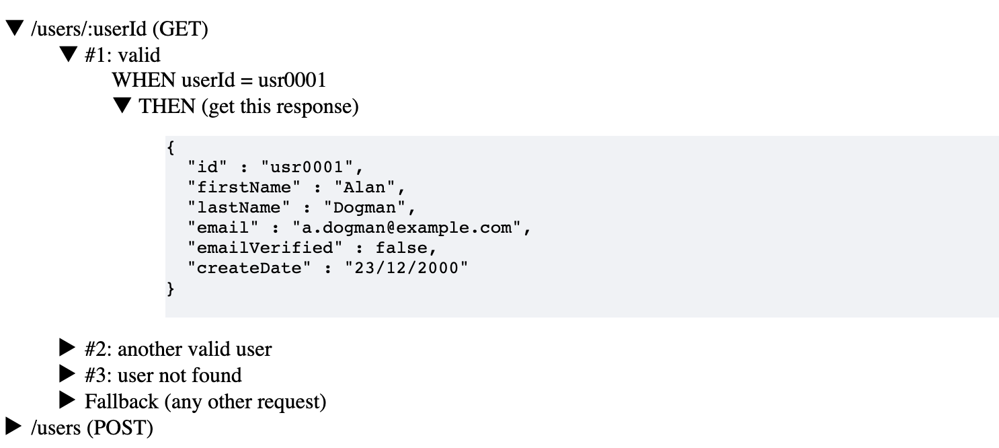

# OpenAPI Native Mock Server

The TestContainer extension runs an **OpenAPI native mock server**. For each API call executed by your code (test)
a given mock response is provided.  
Why native? Because the request-response interactions are defined within the OpenAPI specification, without
the need for an additional application or storage (and therefore complexity).

It is:
* **lightweight**: it runs in a single (small) container
* **fast**: it creates behind the scene a Go service with minimal footprint
* **simple**: it displays the mock expectations in the index page

### Build
Build and run the mock server with Docker:

```docker
docker build --build-arg openapifile=/path/to/myOpenapiFile.yaml -t openapi-testcontainers .

docker run --rm -d -p 8080:8080 --name openapi-testcontainers-app openapi-testcontainers

```
Access the index page
```shell
curl http://localhost:8080/index/
```

### Mock server browser

The `index` page provides a view of the contract interactions, making clear the expectations.
Check it out.




